# 🧬 Liver Cancer Multi-Class Classification using EfficientNetV2-S

A deep learning research prototype for classifying liver MRI images into five categories using **EfficientNetV2-S**, transfer learning, and PyTorch.

> ⚠️ **Disclaimer:** This project is an educational/research prototype and is **not a clinically validated medical diagnostic system**. Predictions should not be used for medical diagnosis or treatment decisions.

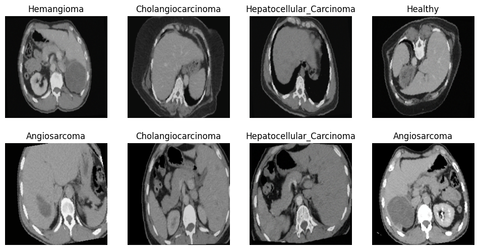


---

## 📌 Overview

This project explores the use of deep learning for automated classification of liver MRI images.

The model uses **EfficientNetV2-S with transfer learning** to classify an input MRI image into one of five categories:

1. Angiosarcoma
2. Cholangiocarcinoma
3. Healthy
4. Hemangioma
5. Hepatocellular Carcinoma

The complete training pipeline was implemented using **PyTorch** and executed on a **Google Colab NVIDIA T4 GPU**.

The project includes:

- Dataset preparation
- Train/validation/test splitting
- Image preprocessing
- Data augmentation
- Transfer learning
- EfficientNetV2-S training
- Validation monitoring
- Best-model checkpointing
- Model inference
- Prediction confidence
- Top-5 predictions

---

## 🎯 Project Objective

The main objective is to investigate whether a pretrained convolutional neural network can learn visual patterns from liver MRI images and distinguish between multiple liver-related categories.

Rather than treating the problem as binary cancer detection, this project approaches it as a **five-class image classification problem**.

### Classification Classes

| Class | Description |
|---|---|
| `Angiosarcoma` | Angiosarcoma category |
| `Cholangiocarcinoma` | Cholangiocarcinoma category |
| `Healthy` | Healthy liver images |
| `Hemangioma` | Hemangioma category |
| `Hepatocellular_Carcinoma` | Hepatocellular carcinoma category |

---

# 🧠 Model Architecture

## EfficientNetV2-S

The project uses:

```text
tf_efficientnetv2_s
````

from the `timm` library.

The model is initialized with pretrained weights:

```python
model = timm.create_model(
    "tf_efficientnetv2_s",
    pretrained=True,
    num_classes=5
)
```

The original classifier is replaced/configured for five output classes.

### Architecture Flow

```text
                Liver MRI Image
                       │
                       ▼
              Image Preprocessing
                       │
                       ▼
              224 × 224 × 3 Image
                       │
                       ▼
             EfficientNetV2-S
              Transfer Learning
                       │
                       ▼
                Feature Extraction
                       │
                       ▼
               Fully Connected
                  5 Outputs
                       │
                       ▼
                Softmax Scores
                       │
                       ▼
            Predicted Liver Category
```

---

# 📊 Dataset

The project uses the:

**Liver Cancer Multiclass Dataset**

from Kaggle.

Dataset source:

[https://www.kaggle.com/datasets/ucimachinelearning/liver-cancer-multiclass-dataset](https://www.kaggle.com/datasets/ucimachinelearning/liver-cancer-multiclass-dataset)

The dataset contains images belonging to five categories.

### Dataset Classes

```text
Angiosarcoma
Cholangiocarcinoma
Healthy
Hemangioma
Hepatocellular_Carcinoma
```

The dataset is **not included in this repository** because of its large size.

Users should obtain the dataset from the original Kaggle source and follow its applicable terms of use.

---

# 🗂️ Dataset Split

The notebook creates separate training, validation, and test datasets.

The approximate split used in the project is:

| Dataset    |      Images | Percentage |
| ---------- | ----------: | ---------: |
| Training   |      ~9,591 |        80% |
| Validation |      ~1,200 |        10% |
| Test       |      ~1,201 |        10% |
| **Total**  | **~11,992** |   **100%** |

The notebook reports:

```text
Train Batches      : 300
Validation Batches : 38
Test Batches       : 38
```

---

# 🖼️ Sample Dataset Images

Example images from the five classes:

| Angiosarcoma | Cholangiocarcinoma | Healthy | Hemangioma | Hepatocellular Carcinoma |
|---|---|---|---|---|
| 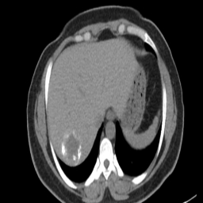 | 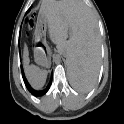 | 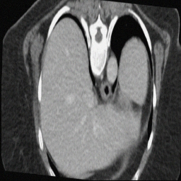 | 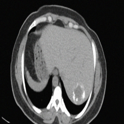 | 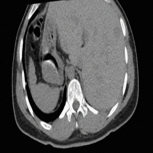 |
| 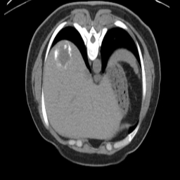 | 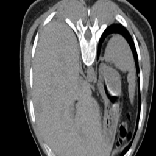 | 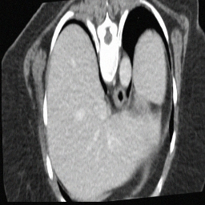 | 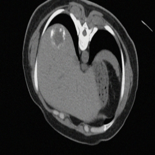 | 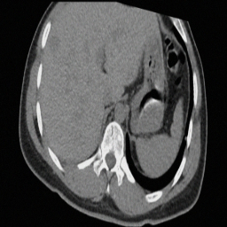 |
| 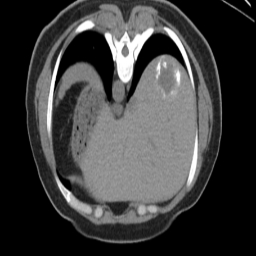 | 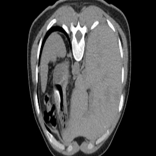 | 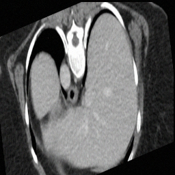 | 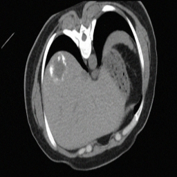 | 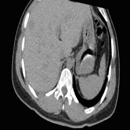 |

The examples demonstrate the visual diversity of the image classification task.

---

# 🔧 Image Preprocessing

Input images are resized to:

```text
224 × 224 pixels
```

The images are converted to RGB and transformed into PyTorch tensors.

ImageNet normalization is applied:

```python
Mean = [0.485, 0.456, 0.406]

Std = [0.229, 0.224, 0.225]
```

The inference pipeline uses:

```python
transforms.Resize((224, 224))
transforms.ToTensor()
transforms.Normalize(
    [0.485, 0.456, 0.406],
    [0.229, 0.224, 0.225]
)
```

---

# 🔄 Data Augmentation

Training images are augmented to improve generalization.

The training pipeline includes transformations such as:

* Horizontal flipping
* Small random rotations
* Brightness variation
* Contrast variation
* Image normalization

The validation and test pipelines use deterministic preprocessing rather than training augmentation.

---

# ⚙️ Training Configuration

The model was trained using the following configuration:

| Parameter          | Value             |
| ------------------ | ----------------- |
| Architecture       | EfficientNetV2-S  |
| Framework          | PyTorch           |
| Model library      | `timm`            |
| Pretrained weights | ImageNet          |
| Number of classes  | 5                 |
| Input size         | 224 × 224         |
| Optimizer          | AdamW             |
| Learning rate      | `1e-4`            |
| Weight decay       | `1e-4`            |
| Loss function      | CrossEntropyLoss  |
| Epochs             | 20                |
| Scheduler          | ReduceLROnPlateau |
| Scheduler factor   | 0.5               |
| Scheduler patience | 2                 |
| Hardware           | NVIDIA T4 GPU     |
| Mixed precision    | Enabled           |

---

# 🚀 Training Process

The training loop performs the following operations:

```text
Load batch
   ↓
Move images and labels to GPU
   ↓
Forward pass
   ↓
Calculate Cross-Entropy Loss
   ↓
Backpropagation
   ↓
AdamW parameter update
   ↓
Calculate training accuracy
   ↓
Evaluate validation dataset
   ↓
Update learning-rate scheduler
   ↓
Save best checkpoint
```

Mixed-precision training was used through PyTorch AMP to improve GPU efficiency.

---

# 📈 Training Accuracy

The model converged rapidly during training.

The notebook records very high validation accuracy during the training run, reaching **100% validation accuracy** during multiple epochs.

Final training output included:

```text
Train Loss       : 0.0001
Train Accuracy   : 100.00%
Validation Loss  : 0.0000
Validation Accuracy : 100.00%

Training Finished
```

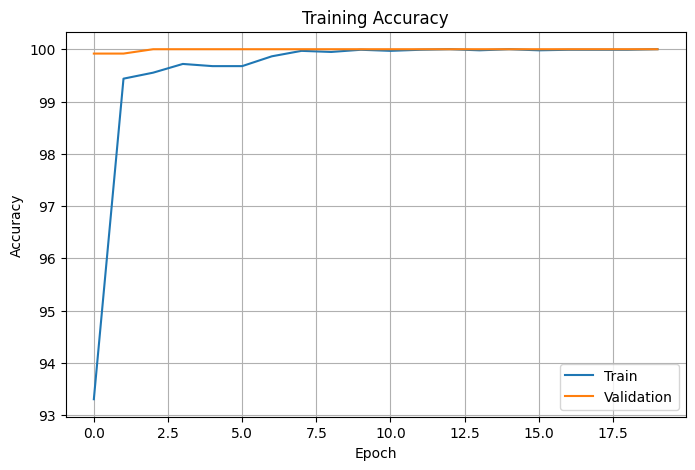

### Important Interpretation

The extremely high validation performance should **not automatically be interpreted as clinical-level accuracy**.

This result is specific to the dataset and experimental setup used in this project. Further investigation would be required to establish generalization to independent clinical datasets.

In particular, patient-level metadata and possible correlations/duplicates within the dataset should be investigated before making medical-performance claims.

---

# 📉 Training Loss

The training loss decreased substantially throughout the training process.

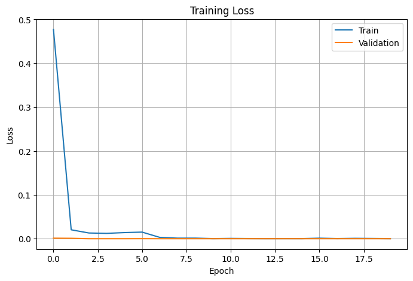

The model eventually reached a very low training loss while maintaining extremely high validation performance.

This indicates that the network successfully fitted the classification task represented by the dataset.

---

# 💾 Model Checkpoint

The best-performing checkpoint is saved as:

```text
best_model.pth
```

The checkpoint contains:

```python
{
    "model_state_dict": ...,
    "classes": ...,
    "accuracy": ...
}
```

The notebook saves the checkpoint whenever validation accuracy improves.

The resulting model file is approximately **81.6 MB**.

Because GitHub's standard Git file handling is not intended for large binary model files, the trained model should be distributed using an appropriate large-file/model-hosting mechanism rather than committing it directly to normal Git history.

---

# 🔍 Model Inference

The trained model can accept an image and produce a prediction.

The inference pipeline:

```text
Input Image
     ↓
Resize to 224 × 224
     ↓
Convert to RGB
     ↓
Normalize
     ↓
EfficientNetV2-S
     ↓
Softmax
     ↓
Class probabilities
     ↓
Prediction + confidence
```

The model calculates probabilities using:

```python
probs = torch.softmax(output, dim=1)[0]
```

The highest-probability class is selected as the prediction.

---

# 📊 Prediction Output

The inference system displays:

* Predicted class
* Prediction confidence
* Top-5 class probabilities

Example output format:

```text
============================================================
Prediction : Hepatocellular_Carcinoma
Confidence : XX.XX%
============================================================

Top 5 Predictions

1. Hepatocellular_Carcinoma    XX.XX%
2. Hemangioma                  XX.XX%
3. Healthy                     XX.XX%
4. Cholangiocarcinoma          XX.XX%
5. Angiosarcoma                XX.XX%
```

The actual probabilities depend on the input image.

---

# 🧪 Evaluation

The notebook includes tools/imports for common classification metrics, including:

* Accuracy
* Precision
* Recall
* F1-score
* Confusion matrix

These metrics are useful because accuracy alone does not provide a complete picture of multi-class classification performance.

For future experiments, evaluation should ideally include:

```text
Accuracy
Macro Precision
Macro Recall
Macro F1
Per-class Precision
Per-class Recall
Per-class F1
Confusion Matrix
```

---

# ⚠️ Important Experimental Limitation

The current experiment uses an image-level dataset split.

For medical imaging research, a stronger experimental design would use a **patient-level split**, where images from the same patient/study cannot appear in both training and evaluation sets.

This matters because visually related images from the same subject can make an image-level split appear easier than an independent-patient evaluation.

Therefore:

> The reported validation performance should be interpreted as performance on this experimental dataset split, not as evidence of clinical diagnostic accuracy.

A future version of this project should investigate patient-level splitting and external validation.

---

# 🏥 Medical Disclaimer

This project is intended for:

* Educational purposes
* Machine-learning experimentation
* Computer-vision research
* Demonstration of transfer learning

It is **not intended for clinical diagnosis**.

The model has not been clinically validated and should not be used to diagnose cancer, determine treatment, or replace a qualified medical professional.

---

# 🛠️ Technologies Used

### Programming

* Python

### Deep Learning

* PyTorch
* torchvision
* `timm`

### Computer Vision

* PIL
* torchvision transforms
* Albumentations

### Machine Learning / Evaluation

* scikit-learn

### Visualization

* Matplotlib
* Seaborn

### Explainability / Experimentation

* Grad-CAM

### Environment

* Google Colab
* NVIDIA T4 GPU
* CUDA

---


# ▶️ Running the Notebook

The easiest way to reproduce the experiment is through Google Colab.

Open the notebook and configure a GPU runtime:

```text
Runtime
   ↓
Change runtime type
   ↓
Hardware accelerator
   ↓
GPU
```

The original experiment was run using an NVIDIA T4 GPU.

The dataset needs to be available in the expected location before running the training cells.

---

# 🧠 Why EfficientNetV2-S?

EfficientNetV2-S was selected as the backbone for this experiment because it provides a strong convolutional architecture suitable for image classification while allowing transfer learning from pretrained weights.

Instead of training a deep neural network completely from scratch, this project starts from pretrained visual representations and adapts the model to the five-class liver MRI classification problem.

---

# 📚 Learning Outcomes

Through this project, the following machine-learning concepts were explored:

* Transfer learning
* CNN-based image classification
* Medical image classification
* Dataset splitting
* Data augmentation
* Image normalization
* GPU acceleration
* Mixed-precision training
* Cross-entropy loss
* AdamW optimization
* Learning-rate scheduling
* Model checkpointing
* Softmax probability estimation
* Multi-class evaluation
* Model inference

---

# 🔬 Future Improvements

Several improvements could make the project more robust:

### 1. Patient-Level Dataset Splitting

Ensure images from the same patient cannot appear across train, validation, and test sets.

### 2. External Validation

Evaluate the model on an independent dataset from a different source.

### 3. More Comprehensive Evaluation

Report:

* Macro F1
* Per-class recall
* Per-class precision
* Confusion matrix
* ROC-AUC where appropriate

### 4. Explainable AI

Use Grad-CAM to visualize regions that influence the model's prediction.

```text
MRI
 ↓
EfficientNetV2-S
 ↓
Prediction
 +
Grad-CAM heatmap
```

### 5. Model Comparison

Compare EfficientNetV2-S against architectures such as:

* ResNet
* DenseNet
* EfficientNet
* ConvNeXt
* Vision Transformer

### 6. Robustness Testing

Evaluate performance under:

* Different image resolutions
* Image quality variations
* Contrast changes
* Noise
* Different acquisition conditions

---

# 📌 Project Status

**Status:** Completed research prototype

### Current capabilities

* [x] Dataset preparation
* [x] Five-class classification
* [x] EfficientNetV2-S
* [x] Transfer learning
* [x] Data augmentation
* [x] GPU training
* [x] Mixed-precision training
* [x] Validation monitoring
* [x] Best-model checkpointing
* [x] Single-image inference
* [x] Confidence estimation
* [x] Top-5 predictions
* [ ] Patient-level validation
* [ ] External dataset validation
* [ ] Clinical validation

---

# 👨‍💻 Author

**Shakib**

This project was developed as an independent machine-learning/computer-vision project exploring deep learning for medical image classification.

---

# 📜 Dataset Attribution

Dataset:

**Liver Cancer Multiclass Dataset**

Source:

[https://www.kaggle.com/datasets/ucimachinelearning/liver-cancer-multiclass-dataset](https://www.kaggle.com/datasets/ucimachinelearning/liver-cancer-multiclass-dataset)

Please refer to the original dataset page for its licensing, attribution, and usage conditions.

---

# ⭐ Acknowledgements

* Kaggle dataset contributors
* PyTorch
* torchvision
* timm
* scikit-learn
* Google Colab

---

## ⚠️ Final Note

This repository demonstrates an experimental deep-learning workflow for liver MRI image classification.

The reported results are specific to the dataset and experimental setup used here. They should not be interpreted as evidence that the model can reliably diagnose liver cancer in real-world clinical settings.

